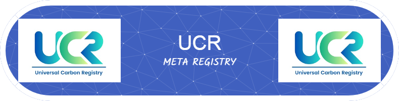

### Welcome to the UCR Meta Registry.  Track / Trace / Deep Dive 
The Universal Carbon Registry (UCR) Standard and Platform is the next-generation model in mining voluntary non-compliance carbon credits and water credits from a wide range of green projects. Launched in 2021, it has showcased a far more efficient, faster, cheaper and de-centralized carbon and water credits ecosystem that rewards climate action by  every small green project owner aiming to decarbonize the economy.

Untitled design.gif

### World's 1st Carbon Credits Program with Environmental Additionality Eligibility For Projects
### World's 1st Water Credits Program for Rainwater/Groundwater/Recycling Projects
### World's 1st Registry to Allow Free Live Transfer of Credits on Blockchain 

<!--
**ucarbonregistry/ucarbonregistry** is a ✨ _special_ ✨ repository because its `README.md` (this file) appears on your GitHub profile.

Here are some ideas to get you started:

- 🔭 I’m currently working on ...
- 🌱 I’m currently learning ...
- 👯 I’m looking to collaborate on ...
- 🤔 I’m looking for help with ...
- 💬 Ask me about ...
- 📫 How to reach me: ...
- 😄 Pronouns: ...
- ⚡ Fun fact: ...
-->
